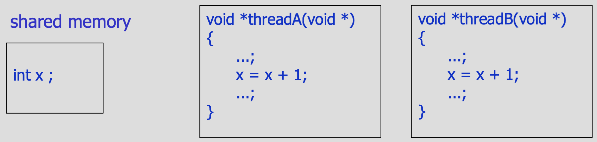
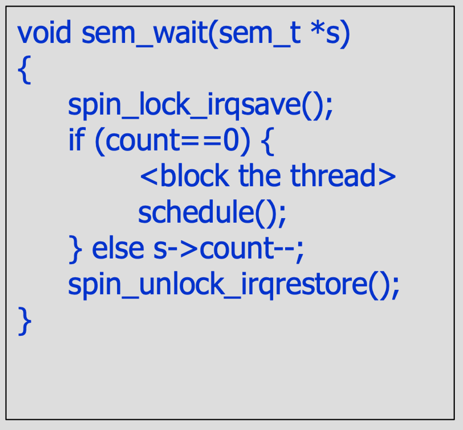
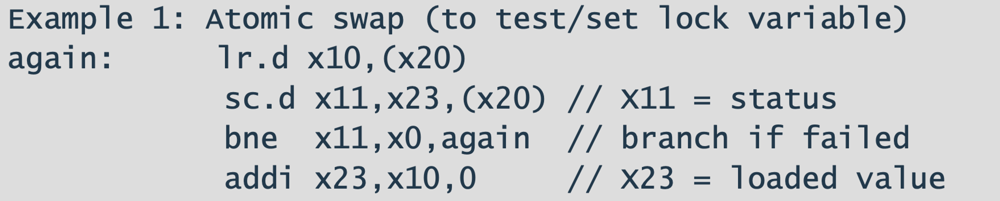

# Concorrenza

### Memoria condivisa

Primo ad essere proposto → tutti i thread possono accedere alla stessa ram.

**Allocazione risorse**

- **Statica** → una volta concessa una risorsa ad thread/processo non può essere revocata.
- **Dinamica** → la risorsa allocata può essere garantita o revocata in maniera dinamica attraverso un manager che ne regola l’accesso.

**Accesso alla risorsa**

- **Dedicato** → accesso uno alla volta
- **Condiviso** → più thread possono accedere contemporaneamente allo stesso thread MA **PROBLEMA MUTUA ESCLUSIONE**

Un istruzione è ATOMICA se non può essere interrotta da nessun’altra istruzione, non possono essere interrotte

La x a cui i due thread accedono è la stessa!

### Consistenza

Espressione booleana rispetto alle variabili interne del sistema.

La proprietà di consistenza deve essere valida prima e dopo l’operazione ma non durante → questo si ottiene sequenzializzando i thread.

Un programma concorrente è **CORRETTO** quando il risultato è corretto per ogni possibile interlacciamento delle operazioni che si hanno su quella risorsa.

- **Esempio**
    
    
    
    
    
    
    
    
    
    
    
    
    
    
    

**Sezione critica**

Le parti del codice che vanno a modificare una risorsa condivisa la quale se non prevengo l’accesso indiscriminato sono dette **SEZIONI CRITICHE** → questa sequenza di informazioni non deve essere mai interrotta da altre operazioni (prima una, poi l’altra).

Due sezioni critiche sulla stessa risorsa devono applicare la **MUTUA ESCLUSIONE** → disabilitando la preemption - introducendo semafori e mutex.

# **Sincronizzazione**

Esempio: produttore - consumatore, thread che hanno velocità differenti.

### **Semafori**

- **Contatore** → conta quanti sono bloccati o quanti posti ho a disposizione.
- **Coda** → task bloccati in coda.
    - **Wait**: blocco.
    - **Signal**: sblocco, effettuato da altri task al posto mio (mi posso bloccare ma solo qualcun’altro può svegliarmi).

- **Wait**
    - se il counter == 0.
    - se il conter > 0 → counter —
- **Signal**
    - se il counter == 0 → controllo se c’è qualcuno che aspetta nella coda dei task **BLOCKED** e lo metto nella coda dei task **READY**.
    - se il counter > 0 → la coda dei task bloccati è vuota e counter++.

**Semafori per la mutua esclusione**

Solo un thread alla volta può accedere alla sezione critica contenente la struttura dati.

Se lo inizializzassi a 0 nessuno dei due farebbe nulla → DEADLOCK.

**Semafori per la Sincronizzazione**

- **Produttore/Consumatore**
    
    
    
    Una sezione è critica quando ha una wait e post sullo stesso semaforo!!!
    

**Mutua esclusione + Sincronizzazione**

---

**Readers/writers con shared buffer**

La scrittura è protetta perché non posso avere due writers attivi, ma comunque la soluzione non risolve la starvation.

Readers should not be counted whenever there is a writer waiting for them!

Così creo starvation sui lettori!

**Soluzione → semafori privati, semaforo utilizzato solo da una classe di oggetti (tutte le volte che voglio un particolare ordinamento/policy su come si gestiscono varie classi di task)**

- If at least one writer is blocked, every next reader blocks
- If at least one reader is blocked, every next writer blocks

Quando una risorsa si libera vogliamo scegliere una policy che favorisca un certo processo bloccato, ad esempio il primo che si è bloccato in ordine di tempo.

### Soluzione 1

Preambolo e Postambulo più complicati

- **Un mutex** → protezione sezioni critiche, inizializzato a 1.
- **Array di semafori privati** **priv[MAXPROC]** → tanti semafori privati tante quante sono le classi da arbitrare (uno per ogni thread ad esempio) (semafori di sincrinizzazione quindi si inizializzano a 0)

Viene fatta una **POST PREVIA** all’interno della condizione if perchè se non ci fosse, la wait finale si troverebbe come valore 0 e si bloccherebbe.

Se la condizione fallisce aumento il contatore dei lettori bloccati, libero il mutex e faccio la wait → si blocca.

**Fase di rilascio**

Se ci sono dei lettori bloccati li sblocco, tante sem_post quanti sono i lettori che si vogliono sbloccare.

Tenere traccia di avere un lettore in più e un bloccato in meno.

**Svantaggi →** Devo fare una wait anche quando non mi blocco. Ad ogni wait ho un cambio di contesto, utilizzo risorse in più quindi non ci piace.

### Soluzione 2

Perchè non rilascio il mutex con certe configurazioni? **nbr— o nbr++ non può avvenire fuori da una sezione critica.**

Non posso fare tante post quanti sono i task bloccati perchè ho solo un mutex, non avrei consistenza sul mutex che ho creato.

---

### Readers/writers

Numero lettori bloccati - Numero scrittori bloccati - Numero scrittori - Numero lettori - Semaforo privato scrittori - Semaforo privato lettori - Semaforo mutex.

Utilizza la Soluzione 1.

Devo sempre rilasciare il mutex prima di bloccarmi!

La lettura del buffer è fuori da ogni sezione critica!

Un lettore sveglia solo degli scrittori perchè mentre esegue un lettore possono eseguire contemporaneamente altri lettori, quindi non può esserci un lettore bloccato mentre un altro è in esecuzione.

### **Implementazioni semafori**

**Sem_wait**

**spin_lock_irqsave() e spin_unlock_irqstore() →** Causano che l’implementazione di sem_wait e sem_post siano loro stesse delle sezioni critiche, dato che se due thread chiamano una sem_wait non vadano in contemporanea.

Codice Kernel Linux → implementazione sem_wait semaphore.c

__down_common → crea la lista e va a mettere nella lista di questi task bloccati il vostro semaforo

**Sem_post**

E’ vuota la lista la waiting list associata a quel semaforo di cui tu stai facendo la up? Se non è sveglio nessuno e aumento il contatore, altrimenti lo sveglio e chiamo lo schedule.

Cancella l’ultimo nella mia lista, affermo che l’ho sbloccato e lo sveglio.

Se ho sbloccato un thread manari ha più priorità di me, quindi interrogo lo scheduler per dirgli se posso continuare io o mandare in esecuzione il thread che ho sbloccato.

---

Se ho due cpu che vogliono andare ad impostare a 0 il semaforo condiviso, voglio che uno dei due lo vada a leggere e lo imposti a 0, effettua un atomic swap di read e write in modo che altri che provano trovano il semaforo a 0, quindi occupato.

Come si creano in assembly, basso livello, questi atomic swap?

NB. Nell’embedded la fa da padrone ARM!!!

### **RISK V atomic support**

**Load reserved** → `lr.d rd, (rs1)` → carica da un **indirizzo rs1** ad un **registro rd,** aggiunge una riserva così che se qualcun altro cerca di accedere a tale registro, io me ne accorgo grazie alla store conditional

- Prende un valore di memoria, indirizzo x, e lo mette in un mio registro nella CPU e aggiunge una riserva sull’indirizzo x.

**Store conditional** → `sc.d rd,rs2,(rs1)` → va a mettere un registro sorgente nella stessa allocazione di memoria che avevo usato prima nella load reserved, mette **rs2** in **rs1,** in un altro registro mi ritorna se ha avuto successo 0, altrimenti un valore che non è 0 in **rd**, l’avere successo è se l’allocazione su cui avevo piazzato una mia riserva prima con la load reserved

- Va prendere quello che ha sul registro, e lo mette nella stessa allocazione di memoria, poi in un secondo registro mi scrive se ha avuto succeso (quando dalla mia lettura alla scrittura nessun altro task/processore è andato a cambiare il valore dell’indirizzo x) oppure se ha fallito (l’allocazione è stata cambiata da qualcuno prima di me).

**Esempi**

1. Piazzo una riserva sull’indirizzo x20 e porto il suo contenuto nel registro x10.
2. Prendo il registro x23 e lo metto nell’allocazione di memoria x20
    1. Se qualche interrupt fa si che venga eseguito del codice che modifichi il’indirizzo x20, fallisce e lo segnala in x11 con un valore diverso da 0
    2. Altrimenti 0
3. **bne → branch not equal** → se x11 è diverso da 0, ritorno ad again/all’inizio (spin/lock)
4. Carico il valore di x23 in x20, scambio il valore che ho nel registro x23 con il valore che ho in memoria all’indirizzo puntato dall’indirizzo x20

1. ***Lock***
2. Metto 1 nel mio registro x12
3. Piazzo una riserva sull’indirizzo x20 e porto il suo contenuto nel registro x10.
4. **bne → branch not equal** → se il valore in x10 è diverso da 0, ritorno ad again (spin/lock), altrimenti continuo.
5. Prendo il registro x12 e lo metto nell’allocazione di memoria x20
    1. Se qualche interrupt fa si che venga eseguito del codice che modifichi il’indirizzo x20, fallisce e lo segnala in x11 con un valore diverso da 0
    2. Altrimenti 0
6. **bne → branch not equal** → se il valore in x11 è diverso da 0, ritorno ad again (spin/lock), altrimenti continuo.
7. ***Unlock***
    1. sd → scrivo x0 nell’allocazione x20, nella unlock non devo piazzare riserve perchè si presuppone che sia l’unico ad aver accesso a quello spazio di memoria se ho fatto bene la parte prima

### Monitors - Condition Variables

Strutture che sono equivalenti ai semafori, ma più puliti e semplici.

Possibilità di far eseguire solo un thread alla volta → garanzia di atomicità, solo un thread alla volta può chiamare quella procedura/metodo

La condition variable è **SOLO** una coda, **NO** contatore.

- **cond_wait()** → sospende il thread che la chiama, primitiva bloccante. (**NON HO CONTATORI**, blocca il thread **EBBASTA**)
    
    Comprende in sè:
    
    $$
    cond\_wait(v,m) =
        \begin{cases}
          sem\_post(m)\\
          block(v) \rightarrow sem\_wait(v)\\
          sem\_wait(m)
        \end{cases}
    $$
    
    Prima di riprendere il mutex qualcun’altro potrà già averlo preso
    
- **cond_signal()** → ricomincia l’esecuzione di uno dei thread bloccati nella coda (se c’è un bloccato ne sveglia uno, quale non lo so) (se non c’è nessuno è come non fare niente).
- **broadcast()** → sblocco tutti.

Quando un processo si blocca sulla condition variable il mutex che protegge la sezione critica viene automaticamente rilasciata.

Prima di fare la cond_wait il mutex viene rilasciato, quando poi io mi risveglio dopo la wait devo guardare ancora se ho il mutex (me lo rimprendo). 

Da quando rilascio il mutex a quando mi blocco sulla mia condition variable (cond_wait) e riprendo il mutex nel frattempo possono arrivare altri trhread che vanno a cambiare la condizione che ha causato il mio bloccaggio → ragione per cui le condition variables vanno usate in un ciclo while()

**Soluzione 2***

La **sem_wait in rosso** è aggiunta così che riprenda il mutex una volta svegliato il semaforo sopra di lui.

Tolgo l’**if** e lo sostituisco con un ciclo **while,** così che controlli sempre la mia condizione di bloccaggio, perchè può essere che qualche altro thread l’abbia cambiata

Tolgo l’**else**, ilascio sempre il mutex!!!

**CircularArray with monitors**

Syncronized non esiste in C!!! → funzione che può essere chiamata solo una alla volta, da una persona alla volta.

### Message Passing

Per comunicare mando un mesaggio ad una destinazione o ricevo un messaggio dalla sorgente.

- **send(destination, message)** → sincrona/asincrona
    
    
    
    Una volta eseguita la send il produttore si blocca in attesa della receive da parte del consumatore, e si sveglia.
    
    Stessa cosa viceversa per la receive.
    
    
    
    Il produttore può continuare ad eseguire dopo la send, ma il consumatore di blocca quando esegue la receive e si sveglia quando il produttore invia la receive.
    
    Lì in mezzo c’è un buffer perché può succedere che la send invii più cose al consumatore, dato che non si blocca.
    
- **receive(source, &message)**
    - **simmetrica →** specifico da chi voglio ricevere un determinato dato
    - **asimmetrica →** dice solo che vuole un dato, ma non dice da chi (Es. webserver)

Primitive offerte dal sistema operativo più onerose a livello di context switch ma più facili a livello di programmazione.

**Non ci sono risorse condivise** in un modello a message parsing, ci sono ma non dobbiamo gestirle noi → le gestisce il sistema operativo.

Ho dei processi dedicati a gestire quella particolare risorsa operativa, spazio di memoria dedicato del gestore.

**Remote Procedure Call - RPC**

Client che chiede ad un server di eseguire una determinata operazione. (Es. chiedo a google un informazione, è google che la esegue per me, non io sul mio pc).

Non fa impazzire perché tra send receive ecc. ci sono molti CONTEXT SWITCH!!!

**Implementazione mutua esclusione con primitive di send/receive.**

- **void * thread** → manda al manager un messaggio, entra nella sezione critica, manda al manager un messaggio che ha finito
- **void * manager** → si mette in attesa subito che qualcuno gli scriva, quando qualcuno gli scrive ritorna l’id del send che gli ha mandato il messaggio e mi metto in attesa su quel particolare sender.

**Implementazione mutua esclusione con primitive di async send e sync receive.**

- **void * thread** **→** manda una send asincrona al manager comunicandogli l’intenzione di entrare in una sezione critica. Visto che la send non è bloccante mi blocco con la receive e aspetto che il manager mi risponda. Finita la sezione critica invio una send al manager comunicandogli che ho finito.
- **void * manager** **→** identifica il messaggio inviato dal thread, invia il messaggio di conferma al thread e rimane in attesa che quast’ultimo finisca.

---

### Deadlocks

Situazione in cui un gruppo di thread è bloccato permanentemente nell’attesa di una risorsa.

**Livelock →** Situazione in cui un gruppo di thread cerca di accedere ad una risorsa ma non riescono mai, qualcosa si esegue ma a vuoto.

Nested Critical Section

- **Risorse riusabili** → possono essere usate da un thread alla volta, e non vengono consumate nell’uso (processore, memoria semafori)
    
    
    
    Sistema con 200Kb di memoria massima
    
    Prima chiedo TOTkb, ne richiedo altri e poi li rilascio → ma se arrivano insieme non bastano le risorse e si blocca.
    
- **Risorse consumabili** → create e distrutte dinamicamente (messaggi e I/O)
    
    
    

**Condizioni favorevoli per una deadlock**

- **Allocazione dinamica di risorse dedicate in mutua esclusione →** solo un processo può accedere alla risorsa, durante l’esecuzione accedi a tale risorsa.
- **Hold & wait →** un processo può essere proprietario di una certa risorsa e si blocca, ho preso il semaforo 1 ma aspetto il semaforo 2.
- **Assenza di preemption →** mentre ho hold di una risorsa non posso revocarla prima di aver effettuato una release del semaforo

Se ho tutte queste 3 condizioni e ho una catena di thread i quali hanno ognuno almeno una risorsa necessaria ad altri thread nella stessa catena(**CIRCULAR WAIT**) può verificarsi un deadlock.

**Come risolvero?**

- **Deadlock prevention (statica) →** imporre ai task che anche quando riescono ad allocare una risorsa non gliela diamo perchè non sono disponibili.
    - Ogni task prende le risorse tutte insieme.
        
        Troppo restrittiva → gli altri task sono bloccati da un altro in attesa che finisca e ne perde la concorrenza.
        
    - Preemptare un thread e dare le risorse a qualcun’altro.
        
        Pericoloso → se sto scrivendo il numero matricola e il task viene bloccato c’è il rischio che legga il dato sbagliato, si può fare solo se il compito del task bloccato può essere dato ad un altro thread.
        
    - Dare l’allocazione della risorsa in un determinato ordine.
        
        Puoi prendere sempre prima s1 e poi s2 ma mai il contrario.
        
        
        
        ***Se tutti i thread accedono alle risorse in un determinato ordine,
        non si può verificare un deadlock!!!***
        
- **Deadlock avoidance (dinamica)** → monitorare il sistema al fine di evitare situazioni pericolose che porterebbero a deadlock.
- **Deadlock detection (dinamica) →** Mi accorgo che tot task sono bloccati o rimangono in un ciclo, posso uccidere uno dei thread bloccati o ritornare una condizione di errore.

Quindi per risolvere una situazione di deadlock posso: abortire tutti i thread, fissare dei checkpoint dai quali i thread ricominceranno l’esecuzione trovato un deadlock, abortite un thread alla volta o preemptare le risorse uno alla volta.