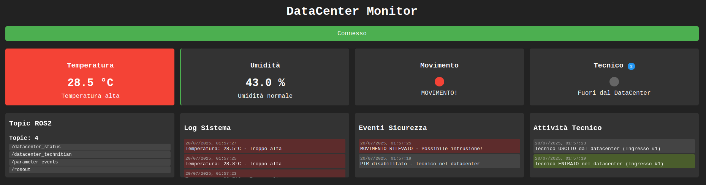
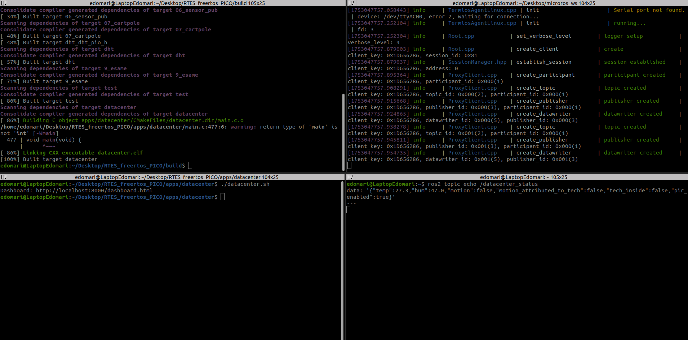

# Real-Time Data Center Security Monitor

## Descrizione del Progetto

Sistema embedded real-time per il monitoraggio e la sicurezza di un datacenter, sviluppato su Raspberry Pi Pico con FreeRTOS e micro-ROS.  
Il sistema integra sensori di temperatura/umidità (DHT11), rilevamento movimento (PIR), pulsante e LED RGB per la gestione della presenza di un tecnico.  
I dati raccolti vengono pubblicati tramite ROS2 su topic dedicati e resi disponibili in tempo reale su una dashboard web interattiva.

### Obiettivi principali:
- **Monitoraggio ambientale:** rilevazione continua di temperatura e umidità.
- **Sicurezza:** rilevamento di movimenti non autorizzati tramite PIR, con discriminazione automatica tra tecnico e possibili intrusioni.
- **Gestione tecnico:** tracciamento ingressi/uscite del personale autorizzato e disabilitazione automatica del sensore PIR durante la presenza del tecnico.
- **Visualizzazione dati:** dashboard web aggiornata in tempo reale tramite websocket, con log di eventi e stato dei topic ROS2.

---

## Architettura e Parti Salienti del Codice

### 1. Firmware Embedded (`main.c`)
- **Gestione sensori:** Lettura periodica di temperatura e umidità (DHT11) e rilevamento movimento (PIR).
- **Gestione tecnico:** Un pulsante permette di segnalare l’ingresso/uscita del tecnico; un LED indica la presenza del tecnico nel datacenter.
- **Logica di sicurezza:** Quando il tecnico è presente, il PIR viene disabilitato. Dopo l’uscita, un breve periodo di tolleranza evita falsi allarmi dovuti al movimento residuo del tecnico.
- **Pubblicazione dati:** I dati vengono serializzati in JSON e pubblicati su due topic ROS2:
  - `/datacenter_status`: stato ambientale e sicurezza (temperatura, umidità, movimento, presenza tecnico, ecc.)
  - `/datacenter_technitian`: stato e contatore ingressi tecnico, timestamp eventi.
- **FreeRTOS:** Tutte le funzionalità sono gestite tramite task concorrenti e code per la comunicazione tra task.

### 2. Bridge ROS-Web (`ros_web_bridge.py`)
- **Sottoscrizione ROS2:** Il nodo si sottoscrive ai topic `/datacenter_status` e `/datacenter_technitian`.
- **WebSocket server:** I dati ricevuti vengono inoltrati in tempo reale ai client web tramite websocket.
- **Gestione topic dinamica:** Il bridge aggiorna periodicamente la lista dei topic ROS2 disponibili e la invia alla dashboard.
- **Broadcast:** Ogni aggiornamento dei dati viene immediatamente trasmesso a tutti i client connessi.

### 3. Dashboard Web (`dashboard.html`)
- **Visualizzazione dati:** Mostra in tempo reale temperatura, umidità, stato del movimento, presenza tecnico e contatore ingressi.
- **Log eventi:** Sezioni dedicate a log di sistema, eventi di sicurezza e attività del tecnico.
- **Aggiornamento live:** Utilizza websocket per ricevere e visualizzare istantaneamente i dati e gli eventi dal bridge Python.
- **Feedback visivo:** Colori e messaggi cambiano in base allo stato di sicurezza e alle condizioni ambientali.

---

## 1. Installazione

1. **Posizionamento della cartella**  
   Copia la cartella estratta in:  
   ```
   /RTES_freertos_PICO/apps/
   ```
2. **Configurazione CMake**  
   Aggiungi la seguente riga al `CMakeLists.txt` principale:
   ```
   add_subdirectory(apps/datacenter)
   ```

---

## 2. Avvio dell’agente micro-ROS

Apri un terminale e avvia l’agente per la comunicazione seriale con il Pico:
```bash
cd ~/Desktop/microros_ws
source install/local_setup.bash
ros2 run micro_ros_agent micro_ros_agent serial --dev /dev/ttyACM0
```

---

## 3. Compilazione e Flash del Firmware

In un secondo terminale, posizionati nella cartella build e compila il progetto:
```bash
cd /RTES_freertos_PICO/build
cmake ..
make
cp datacenter.uf2 $(findmnt -rn -o TARGET -S LABEL=RPI-RP2)/
```
Questo comando copia il firmware compilato sul Raspberry Pi Pico.

---

## 4. Avvio della Dashboard Web

In un terzo terminale, avvia la dashboard per il monitoraggio:
```bash
cd /RTES_freertos_PICO/apps/datacenter
./datacenter.sh
```



---

## 5. Monitoraggio dei Topic ROS2

Per visualizzare i topic pubblicati dal datacenter:
```bash
ros2 topic list
ros2 topic echo /datacenter_status
ros2 topic echo /datacenter_technitian
```

---

## 6. Setup



---

## Crediti

- Lettura DHT: [vmilea/pico_dht](https://github.com/vmilea/pico_dht)

---

**Nota:**  
Ogni comando va eseguito in un terminale separato per garantire il corretto funzionamento del sistema.